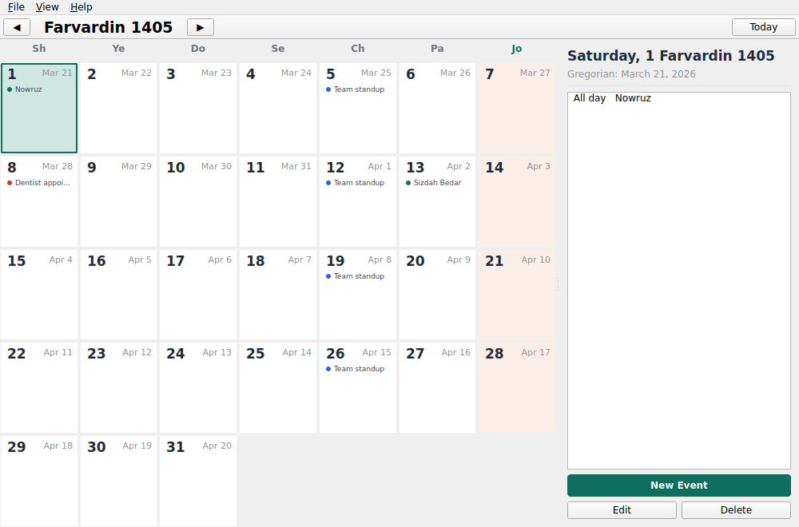

# Solar Hijri Calendar

A native Qt (PySide6) desktop calendar for Linux that uses the **Solar Hijri
(Jalali) calendar** as its primary date system, rather than treating it as a
secondary overlay on the Gregorian calendar. Built for a KDE-native look and
feel, with events, reminders, and recurrence — a small PIM app, not just a
viewer.



## Features

- Month grid view in the Jalali calendar (Farvardin–Esfand), with the week
  running Saturday → Friday and Friday shaded as the weekend, matching Iranian
  and Afghan convention.
- Each day cell shows the Jalali day number plus the equivalent Gregorian
  date, and colored dots for that day's events.
- Click a day to see its agenda in the sidebar; double-click a day (or use
  "New Event") to add one.
- Events support: title, notes, all-day or timed, a reminder (from "at start
  time" up to "1 day before"), and recurrence (none / daily / weekly /
  monthly / yearly).
- Desktop notifications for due reminders via the system tray, which keep
  working even when the main window is closed — closing the window minimizes
  to the tray rather than quitting.
- Nowruz, Sizdah Bedar, and Shab-e Yalda are pre-seeded as yearly recurring
  events on first run.
- All data stored locally in SQLite (`~/.local/share/solar-hijri-calendar/events.db`)
  — nothing leaves your machine.

## Requirements

- Linux with a desktop environment (developed with a KDE/Plasma look in
  mind; works under GNOME and others too, since it's plain Qt6)
- Python 3.10+
- A system tray (for reminder notifications — the app still runs and shows
  events without one, it just can't pop up reminders while closed)

## Quick start

```bash
./run.sh
```

This creates a `.venv`, installs dependencies (`PySide6`, `jdatetime`), and
launches the app. Subsequent runs reuse the same virtual environment.

## Manual install

```bash
python3 -m venv .venv
source .venv/bin/activate
pip install -r requirements.txt
python -m shcalendar
```

## Installing system-wide (optional)

```bash
pip install .
solar-hijri-calendar
```

Note: if you install this way (rather than running from the project
directory), the app will still work, but the taskbar icon falls back to a
generic one — the icon and `.desktop` file under `resources/` aren't wired
into the packaging yet. To get the icon and an application-menu entry:

```bash
mkdir -p ~/.local/share/icons ~/.local/share/applications
cp resources/icon.svg ~/.local/share/icons/solar-hijri-calendar.svg
cp resources/solar-hijri-calendar.desktop ~/.local/share/applications/
update-desktop-database ~/.local/share/applications 2>/dev/null || true
```

## Project layout

```
shcalendar/
  jalali.py          Jalali <-> Gregorian conversion & calendar math
  models.py          Event data model
  recurrence.py      Expands repeating events into concrete occurrence dates
  database.py        SQLite persistence (events + notified-reminder log)
  notifier.py         System tray icon + reminder polling
  ui/
    main_window.py   Main window: menu, toolbar, month/agenda layout
    month_grid.py    The month calendar grid widget
    day_cell.py      A single day cell (custom-painted)
    agenda_panel.py  Sidebar: selected day's events + add/edit/delete
    event_dialog.py  Add/Edit Event dialog
resources/
  icon.svg
  solar-hijri-calendar.desktop
```

## Notes on the calendar system

- Month lengths follow the standard rule: months 1–6 have 31 days, months
  7–11 have 30 days, and month 12 (Esfand) has 29 days in a common year or
  30 in a leap year. Leap-year detection is handled by the `jdatetime`
  library.
- "Monthly" recurrence clamps to the shortest month when needed (e.g. an
  event set for the 31st repeats on the last day of shorter months).
- "Yearly" recurrence on Esfand 30 falls back to Esfand 29 in common years.

## Troubleshooting

**"Could not load the Qt platform plugin 'xcb'"** — Qt6 needs
`libxcb-cursor0` on X11 systems, and some minimal distros don't ship it by
default:

```bash
# Debian/Ubuntu
sudo apt install libxcb-cursor0
# Fedora
sudo dnf install xcb-util-cursor
```

**No reminders after closing the window** — check that a system tray is
actually running in your session (some minimal WMs don't provide one by
default). The app warns you on startup if it can't find one.

## Known limitations

- No calendar sync (CalDAV, Google Calendar, etc.) — this is a local-only
  PIM tool for now.
- No multi-day/spanning events — each event lives on a single day.
- The reminder service only fires while the app is running (including
  minimized to tray); it doesn't wake up your machine or run as a separate
  background service.
